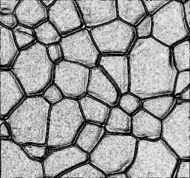
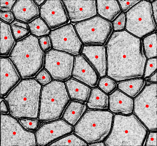
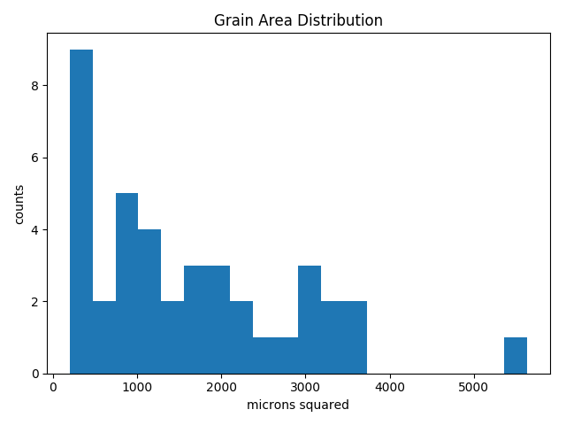

# grains

grains is a software package for the tens of tech savy metallurgists and ceramists out there who are tired of counting grains by hand. The goal of this project is to accelerate the process of grain analysis by applying modern computer vision algorithms.

# Example
  

Grain detection with default settings.

# Roadmap

- ~~Grain counter with OpenCV~~

- ~~Size distribution analysis~~

- ~~Calculate average grain size in accordance with ASTM E112~~

- Validate performance against relevant literature

- Wrap functionality into a simple CLI

- package for pip install
