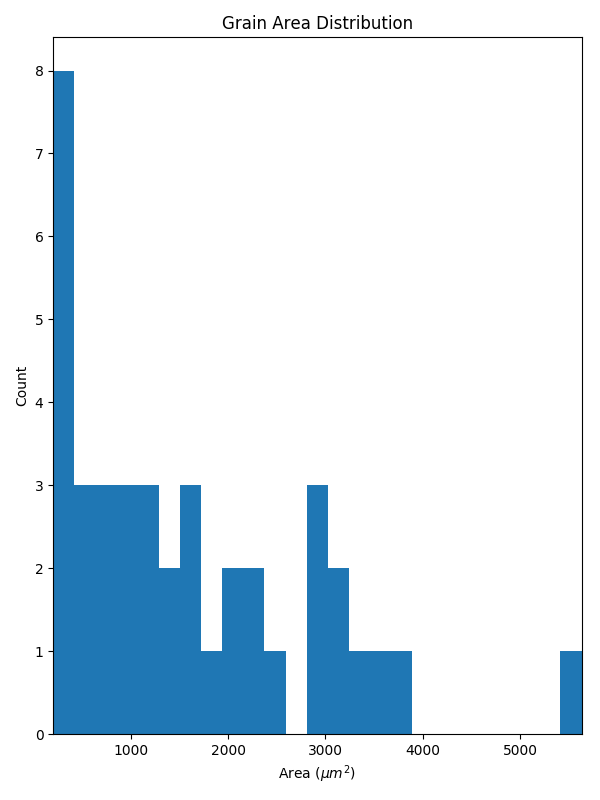

# grains

## Summary

`grains` is a software package for the tech savvy metallurgists and ceramists out
there who are tired of counting grains by hand. The goal of this project is to
automate the process of grain analysis by applying modern computer vision
algorithms.

## Installation

`grains` can be installed easily through the terminal via:

    pip install grains

To install `grains` from source for development:

    git clone https://github.com/seatonullberg/grains.git
    cd grains
    pip install -r requirements.txt
    pip install -e .

## Usage

The following example showcases the basic functionality of `grains` as a software library.
Please note that the image scale in this example is arbitrary as I have not yet found
adequate validation data. Refer to the [examples](./examples) directory for
the simple source code used to generate these results.

If you are more interested in using `grains` as a CLI, the results of
this example can be replicated with the following command.

    grains --h=<image height> --w=<image width> <path/to/image>

### Input Image

### Centroids Image - Default Settings

### Area Histogram - Default Settings

### Text Summarization - Default Settings

    Automatically Generated by grains

    Input filename: test_grains.jpg
    Number of grains: 40
    Grain area mean: 1631.55 um^2
    Grain area variance: 1527136.86 um^2
    Grain area standard deviation: 1235.77 um^2

## Roadmap

- ~~Grain counter with OpenCV~~

- ~~Size distribution analysis~~

- ~~Calculate average grain size in accordance with ASTM E112~~

- ~~Wrap functionality into a simple CLI~~

- ~~Package for pip install~~

- Validate performance and construct test cases

- Make official release on Github
